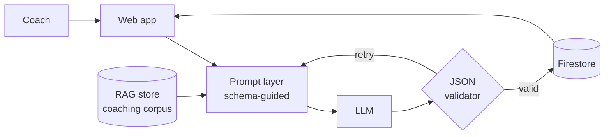

<!-- Profile README · lives in the repo named mlabenski/mlabenski -->

# Hello, I'm Mitchell LaBenski

### 💬 Talk to me

This profile has its own **self-hosted message line** — a static page on GitHub Pages wired to a serverless backend.

**[→ Open the direct line](https://mlabenski.github.io/chat/)**

Messages land straight in my inbox. No forms-as-a-service, no trackers.

⚡ The chat backend architecture is documented <a href="https://github.com/mlabenski/chat">in its own repo</a>.

---

## Current Project — [swimpractices.com](https://swimpractices.com)

A swim-practice generator and workout tracking via Apple Watch. I've logged over 150KM and 60 practices, you can trust that I found all the bugs and annoyances.

- **Schema-guided prompting → structured JSON output**, holding **100% valid JSON across thousands of generations**
- **RAG pipeline** grounding every practice in real coaching methodology
- **Token-cost optimization** so the economics work at scale, not just in a notebook
- **Firestore** as the live data layer, **AWS** underneath

I've learned how to "fine-tune" closed loop AI models like GPTo4 and Opus. Plus, this application requires a STRICT json format from a generative AI model. That took a lot of effort and trial-and-error. 

---

## 💳 Payments-grade engineering

Before AI, I worked in one of the least forgiving corners of software: **card payment systems**.

- Completed **chip-card payment kernel certifications (EMV-family)** — the formal, test-lab-verified process behind every tap and dip at a terminal
- Working fluency in **financial messaging standards used by authorization networks (ISO 8583-class protocols)** — the binary, field-by-field messages that move money in milliseconds

---

## 🧭 The through-line

| | | |
|---|---|---|
| **2020** | Data + instinct | Built predictive models (Python/scikit-learn) as a student — and flagged a security gap in a public-facing system along the way. Analysis and privacy hygiene, from day one. |
| **2021** | Infrastructure | Designed and hardened AWS network architecture: OpenVPN, subnet segmentation, ACLs — enterprise-grade security at a $12–22/month budget. Constraints breed good architecture. |
| **Now** | Production AI | LLM application engineering: structured outputs, RAG, cost-aware design, Firestore/AWS backends. Security-first habits applied to a brand-new stack. |

---
