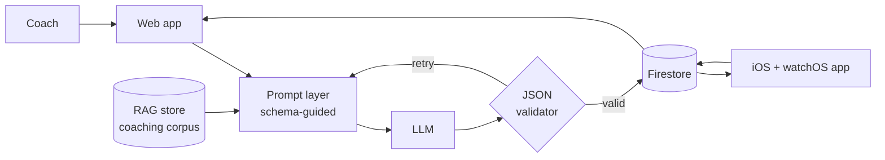

<!-- Profile README · lives in the repo named mlabenski/mlabenski -->

# Hello, I'm Mitchell LaBenski 👋

**Cloud & security engineer building AI into tools people actually use — and swim with.**

 

&nbsp;&nbsp;

  

The direct line is a <b>self-hosted message page</b> — static HTML on GitHub Pages wired to a serverless backend.
No forms-as-a-service, no trackers. <a href="https://github.com/mlabenski/chat">Architecture in its own repo →</a>

---

## 🏊 Now shipping — [Swim Practices](https://swimpractices.com)

An AI swim-practice generator with Apple Watch workout tracking — on the web at
[swimpractices.com](https://swimpractices.com) and on the
[App Store](https://apps.apple.com/us/app/swim-practices/id6752208346).

> **Dogfooded daily** — I've logged over **150 km** and **60 practices** with it myself,
> so you can trust that I found all the bugs and annoyances.

- **Schema-guided prompting → structured JSON output**, holding **100% valid JSON across thousands of generations**
- **RAG pipeline** grounding every practice in real coaching methodology
- **Token-cost optimization** so the economics work at scale, not just in a notebook
- **Firestore** as the live data layer, **AWS** underneath

The hard part wasn't getting an LLM to write a swim practice — it was getting closed models
(GPT-4o, Claude Opus) to hold a **strict JSON contract**, thousands of generations in a row,
at a cost that makes sense. That took a lot of effort and trial-and-error, and it's the
difference between a prototype and a product.

---

## 💳 Payments-grade engineering

Before AI, I worked in one of the least forgiving corners of software: **card payment systems**.

- Completed **chip-card payment kernel certifications (EMV-family)** — the formal, test-lab-verified process behind every tap and dip at a terminal
- Working fluency in **financial messaging standards used by authorization networks (ISO 8583-class protocols)** — the binary, field-by-field messages that move money in milliseconds

---

## 🧭 The through-line

| | | |
|---|---|---|
| **2020** | Data + instinct | Built predictive models (Python/scikit-learn) as a student — and flagged a security gap in a public-facing system along the way. Analysis and privacy hygiene, from day one. |
| **2021** | Infrastructure | Designed and hardened AWS network architecture: OpenVPN, subnet segmentation, ACLs — enterprise-grade security at a $12–22/month budget. Constraints breed good architecture. |
| **Now** | Production AI | LLM application engineering: structured outputs, RAG, cost-aware design, Firestore/AWS backends. Security-first habits applied to a brand-new stack. |

---

<code>MSG 0210 · RESP 00 · APPROVED</code> — thanks for stopping by. Questions, ideas, or just hello:
<a href="https://mlabenski.github.io/chat/">the line is open</a>.

